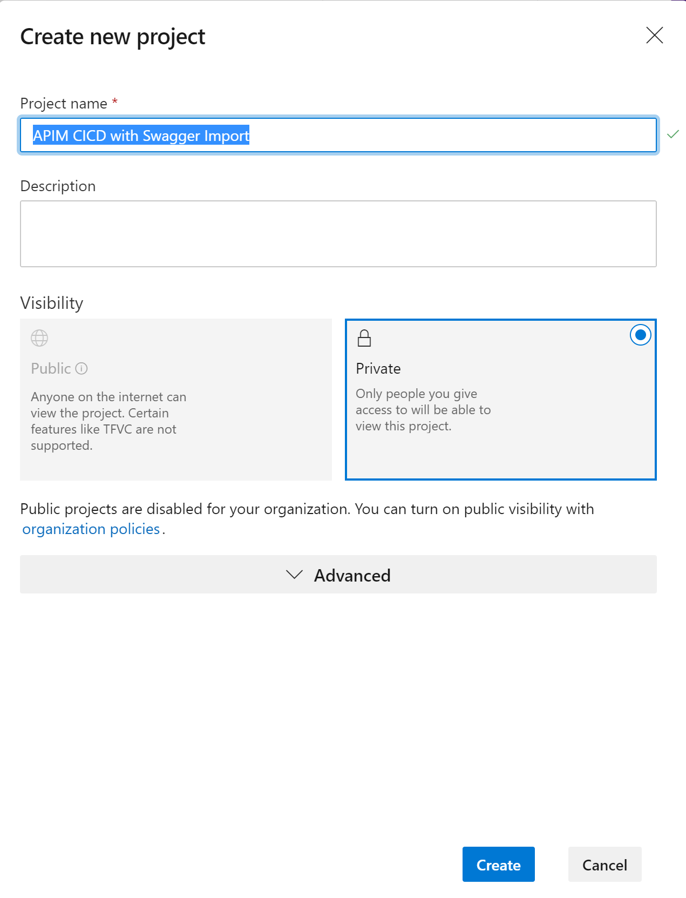
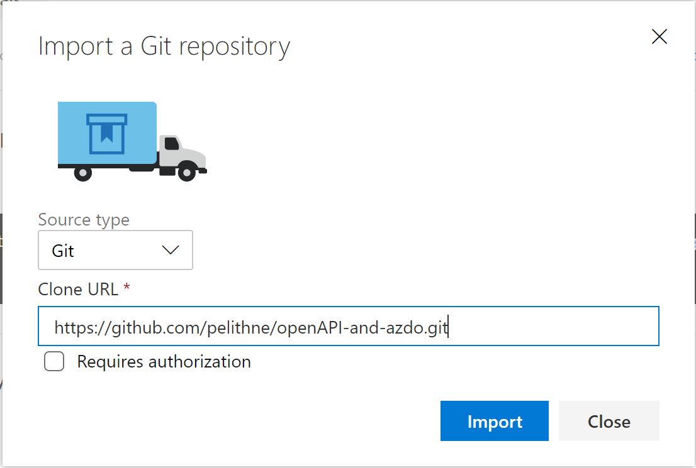
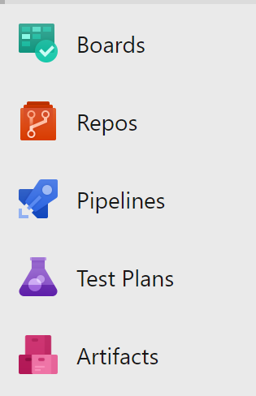
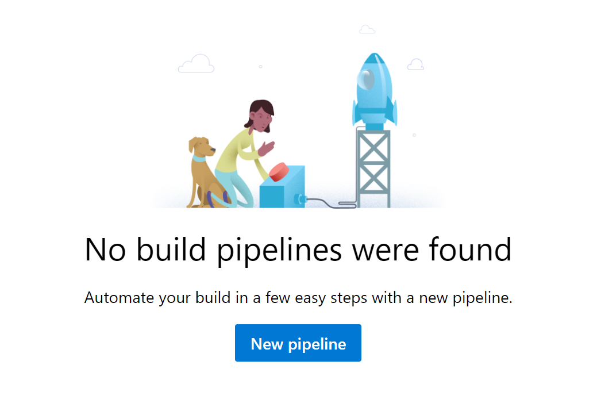
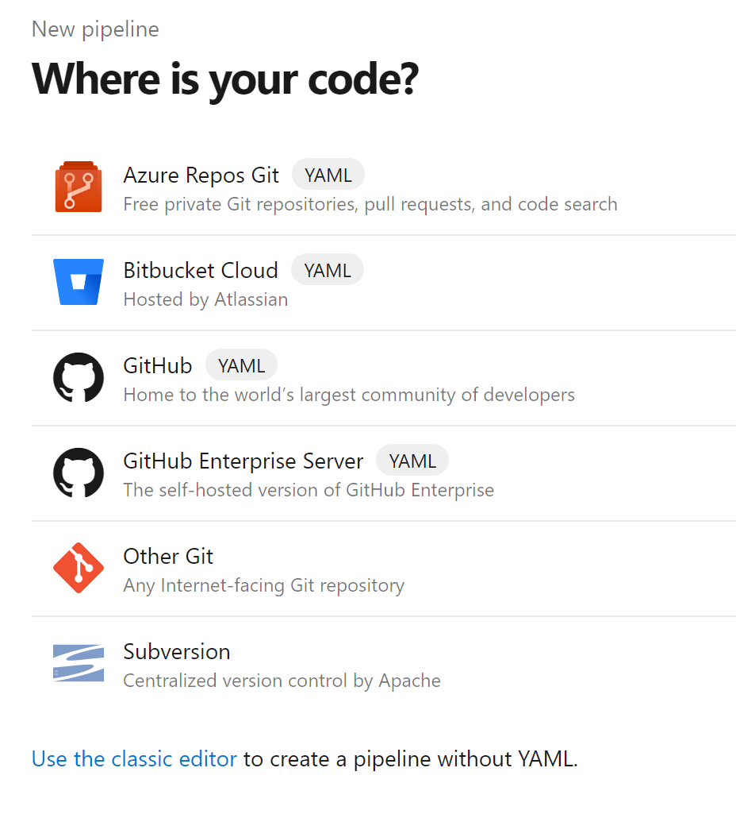

# Introduction
This tutorial contains instruction about how to setup Azure API Management, using ARM templates in Azure DevOps. 

In order to complete this tutorial, you need an Azure Devops account. If you don't have one, you can go  <a href="https://azure.microsoft.com/en-us/services/devops/">here</a>, and select **Start free** for a free account. 

## Create new project
To begin with, create a new project in Azure Devops and give it a suitable name, e.g. **APIM CICD with Swagger Import**, and then click **create**

  

 

## Import this repository
To get access to the ARM templates in this repository, you can import them into Azure Devops. There are other ways to do this, but this is an easy way to get going.

Select **Repos**, then look for the section **or import a repository**, and click on the **import** button.

  

 

In the dialogue that follows, enter the clone url of this repository. In other words https://github.com/pelithne/openAPI-and-azdo.git, and click **import**

  

 

Now that you have the respository with the ARM templates in Azure Devops, you can proceed to create a build pipeline. 

## Create build pipeline
When the project has been created, its time to create a build pipeline. Start by selecting **pipelines** in the left hand panel, and choosing **Builds**.

  

 

In the space that opens, click the button named **New Pipeline**

  

 

The next space that opens, gives you the option to specify where the code of the project is stored.  

Choose **Azure Repos Git**

  

 

You should see the repository you just created, perhaps named **APIM CICD with Swagger Import** unless you came up with a much better one

  

 

