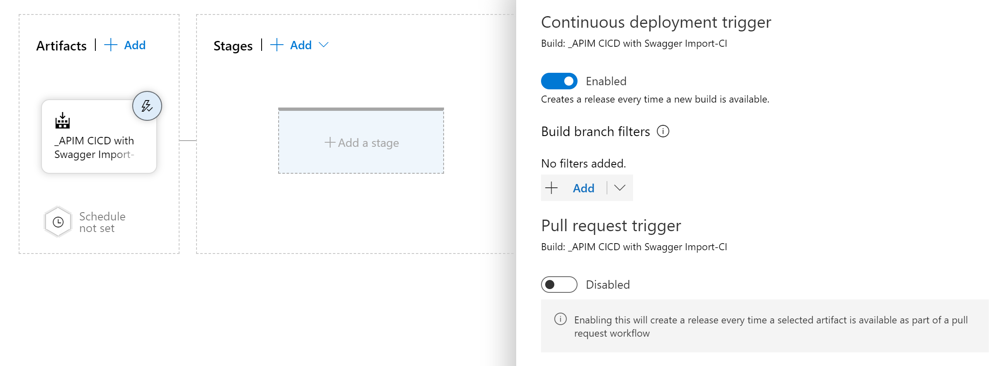

# Introduction
This tutorial contains instruction about how to setup Azure API Management, using ARM templates in Azure DevOps. 

In order to complete this tutorial, you need an Azure Devops account. If you don't have one, you can go  <a href="https://azure.microsoft.com/en-us/services/devops/">here</a>, and select **Start free** for a free account. 

You also need an azure subscription. If you don't have one, create one for free <a href="https://azure.microsoft.com/en-us/free/">here</a>

## Create new project
To begin with, create a new project in Azure Devops and give it a suitable name, e.g. **APIM CICD with Swagger Import**, and then click **create**

  

 

## Import this repository
To get access to the ARM templates in this repository, you can import them into Azure Devops. There are other ways to do this, but this is an easy way to get going.

Select **Repos**, then look for the section **or import a repository**, and click on the **import** button.

  

 

In the dialogue that follows, enter the clone url of this repository. In other words https://github.com/pelithne/openAPI-and-azdo.git, and click **import**

  

 

Now that you have the respository with the ARM templates in Azure Devops, you can proceed to create a build pipeline. 

## Create build pipeline
When the project has been created, its time to create a build pipeline. Start by selecting **pipelines** in the left hand panel, and choosing **Builds**.

  

 

In the space that opens, click the button named **New Pipeline**

  

 

The next space that opens, gives you the option to specify where the code of the project is stored.  

Choose **Use the classic editor to create a pipeline without YAML** at the bottom of the list

  

 

In the screen that follows, you should see the repository you recently cloned from github. If you named it as proposed above, it should look something like this:

  

 

If it doesn't, make sure that **Azure repos git** is selected as source. When it looks right, select **continue**

In the list that appears, select **start with an empty job**

  

 

Start by selecting the tab **triggers** and choose to enable continuous integration:

  

 

This is so that a new build process will be started as soon as something is changed in your repository.

Next go to the tasks, and add a Azure Resource Group Deployment task to your build Phase. You do this by clicking the plus sign next to **Agent Job** and writing **azure resource...**  in the search field, like so:

  

 

Select **Azure Resource Gruop Deployment** and click **Add**

After this you need to fill in some details. This is fairly self-explanatory if you have worked with **Azure** before. You need to select which subscription to use, what to call the resource group and which ARM-template to use. The **location** field is simply the geographic location, e.g. **West Europe**

The ARM template to use is ``apim-instance.json``.

Now make sure to set **Deployment mode** to **validation only**. This is because this step is only supposed to be a validation step, that validates the content of the ARM template. Nothing will actually be deployed to the cloud in this step.

After this you can **Save and Queue** the build pipelline.

Finally, we want to make sure that the validated template from this build step is made available to the release pipeleine that we will create next. That is done by creating another job, once again clicking the plus sign next to the **Agent Job**, and then selecting and adding a **Publish Build Artifacts** task.

Set the **Path to publish** to ``api-instance.json`` and leave the rest of the settings to default. Then select **Save and queue**.

## Create release pipeline
Time to create the pipeline that actually deploys the API Management instance to Azure. Start by selecting **releases** under **pipelines** in the left hand navidation:

  

 

After this, you will create a new release pipeline:

  

 

The first thing you want to do is to add an artifact that will be used as input to the pipeline. The artifact is the ARM-template that was validated during the build step.

  

 

Select the project you have created, perhaps named **APIM CICD with Swagger Import**. Select the build pipeline, perhaps named **APIM CICD with Swagger Import-CI** and leave the rest as defaults.

  

 

Now click the tiny "flash" in the corner of the artifact, to enable a continous deployment trigger.

  

 

In the **Stages** part of the pipeline, click on **Add a stage**. As in the build pipeline, select **Start with an empty job**. Give it a nice name, like **Deploy**.

After this, add a new task to the stage. You can do this by clicking on the **tasks** tab in the top navigation pane. Since you only have one stage, it will be automatically selected:

  

 

Now, in the same way you did in the build pipeline, create an **Azure Resource Group Deployment** 

  

 

The settings should be the same as in the release pipeline, except for three things:
* The template should be the ARM that was made available by the release step. You should be able to naviate to it by selecting the 3 dots to the right of the template field
* Deployment mode should be **Incremental** (instead of validation only, as in the release pipe)
* You should override the template variable named **APIManagementInstanceName**

If you click on the three dots to the right of **Override template parameters** you will see something similar to this:

  

 

Simply press OK. This will populate the text field with the template variables you can override. The only one you need to override is the APIManagementInstanceName. This needs to be a globally unique name, so name it using something reasonably unique, like your corporate signum. 

Finally, we should make sure that this pipeline does not deploy to production in an uncontrolled way. Lets add a **Pre-deployment approval** by clicking on the "flash" on the right side of the deploy task. This will open up a **Pre-deployment conditions**. Set the pre-deployment approvals to enabled, then add your self as approver.

Then click **Save** in the top right of the page.

Now you can go back to the build pipeline and create a build. This should kick off a build process, which will in turn trigger a release process once it finishes. 

When the release pipeline starts up, you will be asked to approve the deployment by opening up the release pipeline and selecting **Approve**
